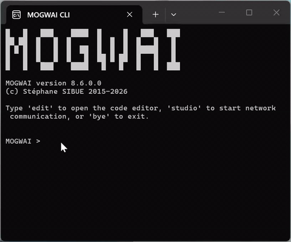
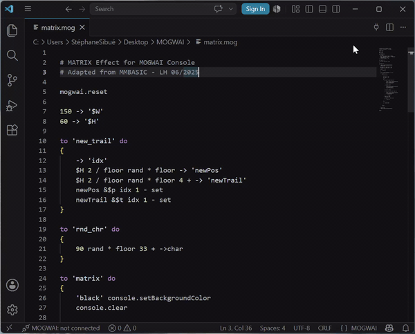
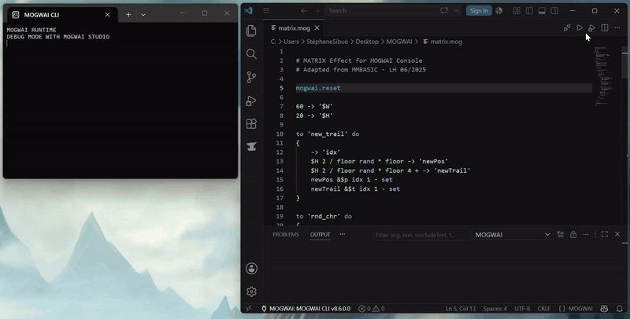
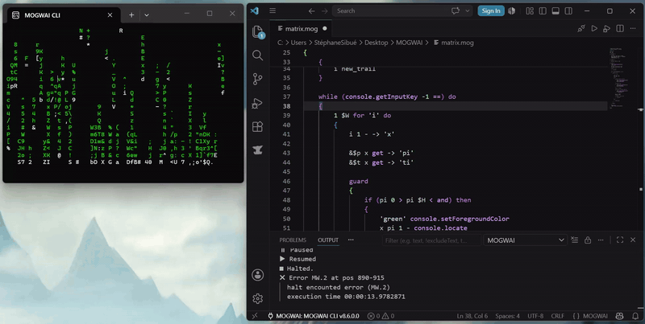
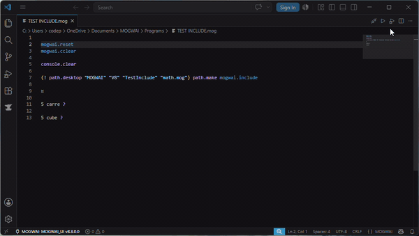
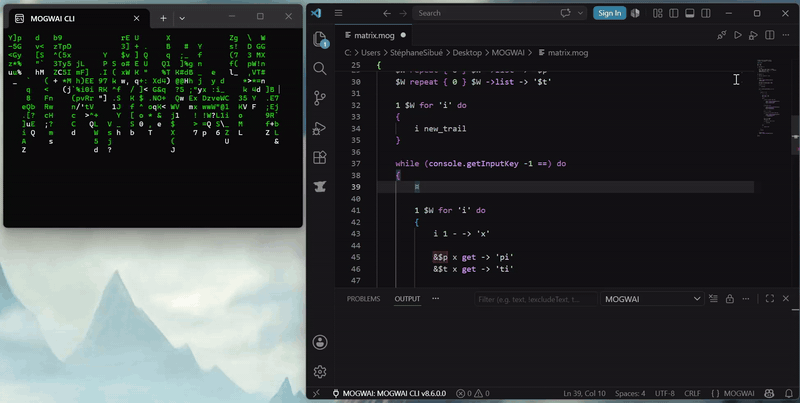
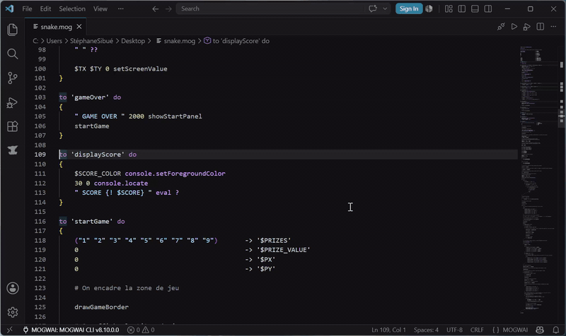

# Using MOGWAI with Visual Studio Code

This guide explains how to set up and use the **MOGWAI Language Support** extension for Visual Studio Code with MOGWAI v8 and later.

> **Requirements**
> 
> - MOGWAI v8.0 or later
> - Visual Studio Code (any recent version)
> - The **MOGWAI Language Support** extension installed in VS Code

---

## Installing the Extension

1. Open Visual Studio Code
2. Open the Extensions panel (`Ctrl+Shift+X`)
3. Search for **MOGWAI**
4. Click **Install** on **MOGWAI Language Support** by MOGWAI

Or install it directly from the Marketplace:
👉 https://marketplace.visualstudio.com/items?itemName=mogwai.mogwai-language

---

## Getting Started — Step by Step

The connection between VS Code and the MOGWAI runtime follows a specific order. **All three steps must be done in sequence.**

### Step 1 — Start the host application

Launch the application that hosts the MOGWAI runtime. In the case of MOGWAI CLI, open a terminal and run it normally.

### Step 2 — Activate connection mode

Once the host application is running, activate connection mode by typing the `studio` command. This puts the runtime in a waiting state, ready to accept incoming connections from VS Code (or MOGWAI STUDIO).



**MOGWAI CLI example:**

```
> studio
```

The runtime will display its connection address (IP and port), confirming it is ready and waiting.

> **Important:** without this step, VS Code will not be able to find or connect to the runtime.

### Step 3 — Connect from VS Code

Open a `.mog` file in VS Code. The MOGWAI toolbar buttons will appear in the editor.

Click the **`$(plug)` Connect** button in the editor toolbar (top right). VS Code will broadcast a discovery request on the local network and display a list of available runtimes.

Select your runtime from the list — it will show the runtime name, IP address, MOGWAI version, OS, and .NET framework version.



Once connected:

- The status bar at the bottom left shows **`MOGWAI: [runtime name] v[version]`**
- The **Run** ▶ and **Debug** 🐛 buttons become available in the toolbar
- Syntax highlighting is enriched with the runtime's specific primitives

---

## Running Code

With a `.mog` file open and a runtime connected, click the **▶ Run** button in the editor toolbar (or use `Ctrl+Shift+P` → **MOGWAI: Run Current File**).



Execution output appears in the **MOGWAI Output Channel** (View → Output → MOGWAI):

```
── RUN ──────────────────────── 10:55:16 PM ──
▶ Running…
■ Done in 00:00:41.3545643
```

---

## Debugging

Click the **🐛 Debug** button to run the current file in debug mode. In this mode, breakpoints placed in the code (`debug.halt` primitive or `¤` symbol) are honored by the runtime.



### When the runtime pauses on a breakpoint

- The current instruction is **highlighted in blue** in the editor
- The **Runtime panel** (sidebar) updates with the current stack, local variables, and global variables
- Three buttons appear in the toolbar:
  - **⏸ Pause** — force a pause at any time during execution
  - **⏭ Step** — execute the next instruction
  - **▶ Resume** — resume normal execution

### Multi-file debugging

When a script uses `mogwai.include` to include external code files, the debugger follows execution across files. When execution enters an included file, VS Code opens it automatically side by side and moves the instruction pointer there. When execution returns to the main file, the pointer follows.



### Stopping execution

Click the **⏹ Halt** button at any time to stop execution immediately, whether in normal or debug mode.

---

## TRON Mode — Animated Execution

The `debug.tron` primitive activates trace mode, which replays script execution instruction by instruction with a configurable delay between each step:

```
100 debug.tron   # trace mode with 100ms delay between instructions
```

In this mode, the extension highlights each instruction as the runtime executes it, following the code in real time — including across included files. To stop TRON mode, use `debug.troff` or `mogwai.reset`.

> **Tip:** TRON mode is useful for understanding how an algorithm unfolds or tracking down a subtle bug without having to place breakpoints manually.

---

## The Runtime Panel

When connected, a **MOGWAI** icon appears in the VS Code activity bar (left sidebar). Click it to open the **Runtime** panel, which shows:

- **Stack** — the current contents of the MOGWAI stack (RPN)
- **Local Variables** — name, type, and value of all local variables
- **Global Variables** — name, type, and value of all global variables

This panel refreshes automatically after each execution, pause, or step. Use the **$(refresh) Refresh** button at the top of the panel to refresh manually at any time.



---

## Function List

The extension automatically lists all functions declared in the current `.mog` file. Two ways to access it:

**Outline panel** — visible in the Explorer sidebar (`Ctrl+Shift+E`), scroll down to the **OUTLINE** section. All functions are listed with their full signature.

**Go to Symbol** (`Ctrl+Shift+O`) — opens a Quick Pick with all functions. Start typing to filter, press Enter to jump directly to the declaration.



All three declaration forms are supported and multi-line declarations are also recognized.

---

## Locally Declared Functions

Functions you declare in your `.mog` files are automatically recognized by the extension:

- **Colored in golden italic** — visually distinct from language keywords and runtime primitives
- **Go to Definition** (`F12` or right-click → Go to Definition) — jump directly to a function's declaration from any call site
- **Insert Function Call** — right-click → **MOGWAI: Insert Function Call**, or `Ctrl+Shift+P` → **MOGWAI: Insert Function Call**, to open a Quick Pick of all declared functions and insert the selected name at the cursor position

If a locally declared function name conflicts with a runtime primitive, the primitive color takes priority — a useful visual signal to spot naming conflicts.

This feature is active even without a connected runtime.

---

## Disconnecting

Click the **`$(debug-disconnect)` Disconnect** button in the editor toolbar, or use `Ctrl+Shift+P` → **MOGWAI: Disconnect**.

After disconnecting, the runtime returns to its idle state and the dynamic primitive highlighting is cleared.

---

## Network Configuration

The MOGWAI runtime listens for discovery requests on **UDP port 1968**. Make sure this port is not blocked by your firewall.

If VS Code cannot find the runtime automatically, check that:

- The host application is running
- The `studio` command has been entered
- Both machines are on the same local network
- UDP port 1968 is open on the machine running the runtime

> **Note:** UDP discovery works across the local network — VS Code and the runtime do not need to be on the same machine.

---

## Syntax Highlighting

The extension provides two layers of syntax highlighting:

**Static highlighting** (always active, no connection required):

- Control keywords: `if`, `then`, `else`, `while`, `for`, `foreach`, `forever`, `switch`, `guard`, `trap`, `class`...
- Operators: `->` (store), `=>` (typed store), `-->` (pipeline)
- Sigils: `&A` (in-place reference), `@A` (static eval), `!A` (immediate eval)
- Strings with `{! ... }` interpolation blocks
- Variable names: `'myVar'`
- Numbers, constants (`true`, `false`, `null`, `empty`)
- Comments: `# line comment`

**Dynamic highlighting** (requires a connected runtime):

- All runtime primitives, color-coded by group:

| Group | Category | Example primitives                          |
| ----- | -------- | ------------------------------------------- |
| `GE`  | General  | `split`, `join`, `size`, `get`, `set`       |
| `MH`  | Math     | `sin`, `cos`, `sqrt`, `pow`, `floor`        |
| `SK`  | Stack    | `dup`, `drop`, `swap`, `clear`, `depth`     |
| `RT`  | Runtime  | `mogwai.exit`, `mogwai.halt`, `mogwai.info` |
| `ER`  | Error    | `error.last`, `error.throw`, `error.reset`  |
| `DG`  | Debug    | `debug.write`, `debug.halt`, `debug.tron`   |

---

## Snippets

The extension includes snippets for all common MOGWAI structures. Type the prefix and press `Tab`:

| Prefix      | Structure                                  |
| ----------- | ------------------------------------------ |
| `if`        | `if (...) then { }`                        |
| `ife`       | `if (...) then { } else { }`               |
| `while`     | `while (...) do { }`                       |
| `dowhile`   | `do { } while (...)`                       |
| `for`       | `1 10 for 'i' do { }`                      |
| `fors`      | `1 10 for 'i' step 2 do { }`               |
| `repeat`    | `10 repeat { }`                            |
| `forever`   | `forever do { }`                           |
| `foreach`   | `(list) foreach 'item' do { }`             |
| `transform` | `(list) foreach 'item' transform { }`      |
| `filter`    | `(list) foreach 'item' filter { }`         |
| `switch`    | `switch { (...) then { } }`                |
| `to`        | `to 'name' do { }`                         |
| `tow`       | `to 'name' with [x: .number] do { }`       |
| `top`       | `to 'name' params [x: (.number 0)] do { }` |

---

## Extension Settings

| Setting                             | Default | Description                                 |
| ----------------------------------- | ------- | ------------------------------------------- |
| `mogwai.runtime.udpPort`            | `1968`  | UDP port used for runtime discovery         |
| `mogwai.runtime.discoveryTimeoutMs` | `5000`  | How long (ms) to wait for runtime responses |

---

## Compatibility

- MOGWAI **v8.0 or later** is required
- Earlier versions of MOGWAI do not support the `studio` connection mode

---

## Changelog

| Version | Changes |
| ------- | ------- |
| 1.3.0 | Insert Function Call command (Quick Pick + right-click context menu) |
| 1.2.0 | Locally declared function coloring (golden italic), Go to Definition (`F12`) |
| 1.1.0 | Function list — Outline panel and Go to Symbol for all declared functions |
| 1.0.3 | Multi-file step-by-step debugging, TRON mode across included files, editor focus fix, unexpected disconnection handling |
| 1.0.0 | Initial release — syntax highlighting, snippets, runtime connection, execution, debug, Runtime panel, autocompletion |
